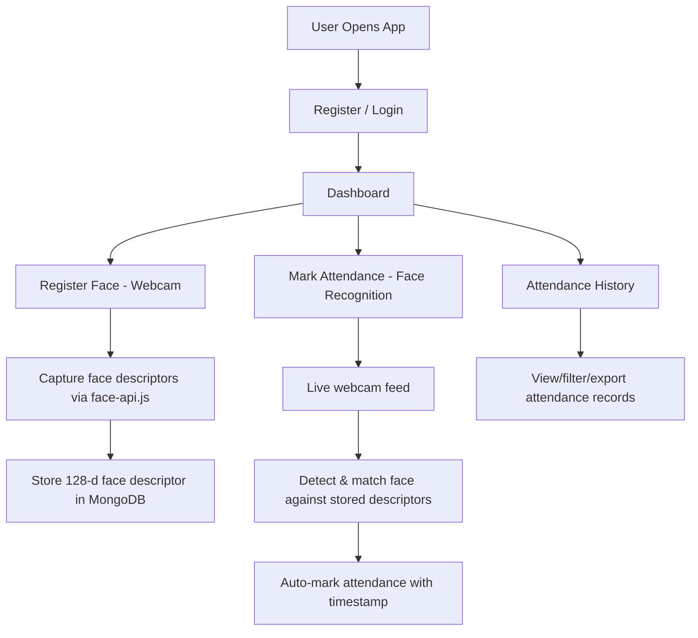

# Online Attendance System with Facial Recognition

Transform the existing MERN app into a fully-featured attendance management system that uses the browser's webcam and **face-api.js** for real-time facial recognition to mark attendance.

## Architecture Overview

## Tech Stack

| Layer | Technology |
|-------|-----------|
| Face Detection & Recognition | **face-api.js** (runs entirely in browser, no Python needed) |
| Frontend | React 18 + Vite + Vanilla CSS |
| Backend | Express.js + MongoDB + Mongoose |
| Auth | JWT + bcrypt (existing) |
| Webcam | Browser `getUserMedia` API |

> [!IMPORTANT]
> **face-api.js** runs entirely in the browser using TensorFlow.js. No Python or server-side ML is needed. Face descriptor vectors (128-dimensional float arrays) are stored in MongoDB and compared client-side for matching.

## Proposed Changes

### Backend — Models

#### [MODIFY] [User.js](file:///c:/Users/91933/Downloads/website/backend/models/User.js)
- Add `role` field (`admin` | `employee`) — default: `employee`
- Add `department` field
- Add `employeeId` field (unique)
- Add `faceDescriptor` field (array of 128 floats) — stores the enrolled face
- Add `faceRegistered` boolean flag

#### [NEW] [Attendance.js](file:///c:/Users/91933/Downloads/website/backend/models/Attendance.js)
- `userId` (ref to User)
- `date` (Date, indexed)
- `checkIn` (timestamp)
- `checkOut` (timestamp, nullable)
- `status` enum: `present`, `late`, `absent`, `half-day`
- `method`: `facial` | `manual`
- `confidence` (float — face match confidence score)

---

### Backend — Routes

#### [NEW] [attendance.js](file:///c:/Users/91933/Downloads/website/backend/routes/attendance.js)
- `POST /api/attendance/check-in` — Mark check-in (stores face descriptor match confidence)
- `POST /api/attendance/check-out` — Mark check-out
- `GET /api/attendance/today` — Get today's record for current user
- `GET /api/attendance/history` — Get attendance history with date range filters
- `GET /api/attendance/stats` — Get summary stats (total present, late, absent days)
- `GET /api/attendance/all` — (Admin) Get all users' attendance

#### [MODIFY] [auth.js](file:///c:/Users/91933/Downloads/website/backend/routes/auth.js)
- `POST /api/auth/register-face` — Save face descriptor to user profile
- `GET /api/auth/face-status` — Check if face is registered
- `GET /api/auth/all-faces` — Get all registered face descriptors (for matching)
- Add `department` and `employeeId` to registration

#### [MODIFY] [server.js](file:///c:/Users/91933/Downloads/website/backend/server.js)
- Mount new `/api/attendance` routes
- Increase JSON body size limit (face descriptors are large arrays)

---

### Frontend — New Dependencies

- **face-api.js** — Face detection, landmark detection, and recognition in browser
- Face-api.js model files (downloaded to `public/models/`)

---

### Frontend — Pages

#### [MODIFY] [Home.jsx](file:///c:/Users/91933/Downloads/website/frontend/src/pages/Home.jsx)
- Complete redesign as Attendance System landing page
- Hero section with facial recognition animation
- Feature cards: Face Registration, Live Recognition, History & Analytics
- Stats counters animated on scroll

#### [MODIFY] [Dashboard.jsx](file:///c:/Users/91933/Downloads/website/frontend/src/pages/Dashboard.jsx)
- Complete redesign as Attendance Dashboard
- Today's attendance status with check-in/check-out times
- Quick stats cards: Days Present, Late, Absent this month
- Recent attendance table (last 7 days)
- Quick action buttons: Mark Attendance, Register Face

#### [NEW] [FaceRegister.jsx](file:///c:/Users/91933/Downloads/website/frontend/src/pages/FaceRegister.jsx)
- Live webcam feed with face detection overlay
- Capture button to take face snapshot
- Extract 128-d face descriptor via face-api.js
- Save to backend
- Visual feedback: face bounding box, landmarks, success animation

#### [NEW] [MarkAttendance.jsx](file:///c:/Users/91933/Downloads/website/frontend/src/pages/MarkAttendance.jsx)
- Live webcam with real-time face detection
- Compare detected face against all registered descriptors
- Show match result with confidence percentage
- Auto check-in/check-out with animated feedback
- Prevent duplicate check-in on same day

#### [NEW] [AttendanceHistory.jsx](file:///c:/Users/91933/Downloads/website/frontend/src/pages/AttendanceHistory.jsx)
- Calendar-style view with color-coded days
- Sortable/filterable table view
- Date range picker
- Export to CSV
- Monthly summary with pie chart (present/late/absent)

#### [MODIFY] [Register.jsx](file:///c:/Users/91933/Downloads/website/frontend/src/pages/Register.jsx)
- Add department dropdown and employee ID field

---

### Frontend — Components & UI

#### [MODIFY] [Navbar.jsx](file:///c:/Users/91933/Downloads/website/frontend/src/components/Navbar.jsx)
- Rebrand to "FaceAttend" with face-scan icon
- Add navigation links: Dashboard, Mark Attendance, History
- Mobile hamburger menu

#### [NEW] [WebcamFeed.jsx](file:///c:/Users/91933/Downloads/website/frontend/src/components/WebcamFeed.jsx)
- Reusable webcam component with face-api.js overlay
- Shows face detection bounding boxes in real-time
- Neon-glow scanning animation effect

#### [NEW] [AttendanceTable.jsx](file:///c:/Users/91933/Downloads/website/frontend/src/components/AttendanceTable.jsx)
- Reusable table for attendance records
- Sortable columns, status badges

#### [NEW] [StatsCard.jsx](file:///c:/Users/91933/Downloads/website/frontend/src/components/StatsCard.jsx)
- Animated stat card with icon, value, trend

#### [MODIFY] [index.css](file:///c:/Users/91933/Downloads/website/frontend/src/index.css)
- Complete retheme for attendance system
- Webcam feed styles with scanning animations
- Face detection overlay with neon bounding boxes
- Calendar/table styles
- Status badge styles (present/late/absent)
- Glassmorphism cards with border glow effects
- Pulsing animations for live detection

---

### Face-API.js Model Files

#### [NEW] `frontend/public/models/`
- Download pre-trained models: `ssd_mobilenetv1`, `face_landmark_68`, `face_recognition`
- These are static files served by Vite

---

## UI Design

- **Theme**: Dark mode with cyan/violet accent gradient (keeping existing palette)
- **Webcam area**: Rounded container with neon-cyan scanning line animation
- **Face detection**: Real-time bounding boxes with glow effect
- **Status badges**: Color-coded pills (green=present, amber=late, red=absent)
- **Cards**: Glassmorphism with subtle border animations
- **Transitions**: Smooth page transitions, staggered card animations

## Verification Plan

### Automated Tests
- Run `npm run dev` and verify both servers start
- Test API endpoints: register, login, check-in, check-out, history

### Manual Verification
- Open browser, register a new user
- Navigate to Face Registration → allow webcam → capture face
- Navigate to Mark Attendance → verify face is detected and matched
- Check Dashboard for updated stats
- View Attendance History with records
